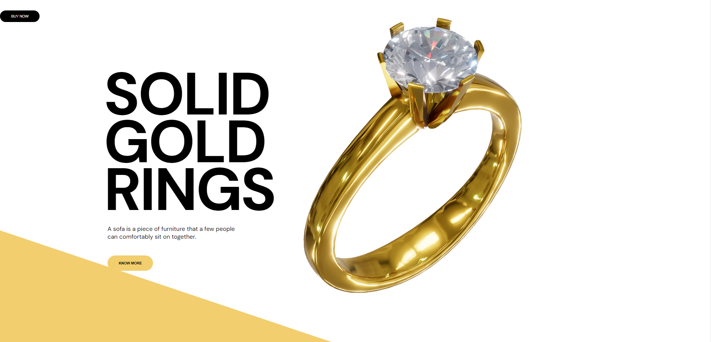

# Threejs + GSAP + WEBGi

## 100% Free Course

This is a template used in my fast course "building scrollable pages with ScrollTrigger and Threejs" for a vanilla (no ui-framework) project with webgi engine in typescript using parcel bundler.

## Preview Image

<a href="http://ring-webgi.netlify.app"></a>

## Page content

On my YouTube channel, you can find a **step by step** video on how to use this source code to build your own pages.

- Chosing a model
- Use WEBGi editor to create images
- Design the page using exported images from WEBGi
- Setup the WEBGi boilerplate into VSCODE
- Change the model
- Create the html and CSS
- Import GSAP and setup the library
- Create the ScrollTrigger animation for the camera
- Final adjustments

## Getting started

First install the dependencies:

```bash
npm install
```

To run the project in development mode:

```bash
npm start
```

Then navigate to [http://localhost:1234/index.html](http://localhost:1234/index.html) in a web browser to see the default scene in a viewer.

The assets are stored in the `assets` directory.

To build the project for production:

```bash
npm run build
```

## Documentation

About webgi: [https://webgi.xyz/](https://webgi.xyz/)

For the latest version and documentation: [WebGi Docs](https://webgi.xyz/docs/).

## License

For license and terms of use, see the [SDK License](https://webgi.xyz/docs/license).
